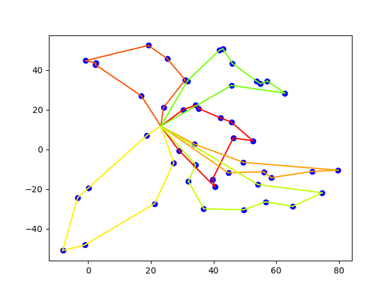

# CTOP
## Constraints Team Orienteering Problem


Given a central depot, a set of customers with different demands, serving time and profits and a fleet of vehicles with capacity and duration limitations we created an algorithm
that finds the most profitable customers and creates routes while satisfying the customers and vehicles constraints. All customers are represented as 
nodes in a Cartesian coordinate system. The [instance.csv](https://github.com/dbouris/optimization_methods_competition/blob/main/paradoteo/instance.csv) file 
contains each customer 𝑖 that has a product demand 𝑑, a required service time 𝑠𝑡 and a profit 𝑝. A fleet of 𝑘 car trucks is located in the central depot. 
Each of the vehicles has a product capacity equal to 𝑄. Vehicles start from the depot, serve customers and then return back to the central depot. Each 
vehicle performs one route. Each customer can be covered (it is not necessary how it will be covered) by one visit of a single vehicle. In this case, 
the customer returns his profit. The total time of a route (transition time and customer service time) cannot exceed a time limit 𝑇. At the end we will 
create 𝑘 routes that will maximize the total profit.

## Methodology

- We created a first solution for the problem using the Minimum-Cost Insertion Heuristic (MCI). We checked each possible insertion position for the most profitable customers and selected the one that is feasible and has the least additional cost (capacity, transition time, service time).
- We applied local search to the initial solution to improve it. We used local search operators to seek small modifications that can reduce the cost in every route. With the operators swap, relocation and twoOpt we made modifications inside each route and between different routes in order to be able to serve more customers. 
- We created methods that identify and make exchanges between customers or pairs of customers inside every route that can be replaced with customers that have the same cost but they are more profitable. 
- Tabu search was used to further improve the solution. We accepted worsening moves in the hope to improve the solution and we prohibited solutions that caused cicles in the local search. 
- Random removal was used to destroy a part of the solution in order to create a better new solution

## Run

Clone the project and use the following commands to generate the solution and the graph 

```
python solver.py
```